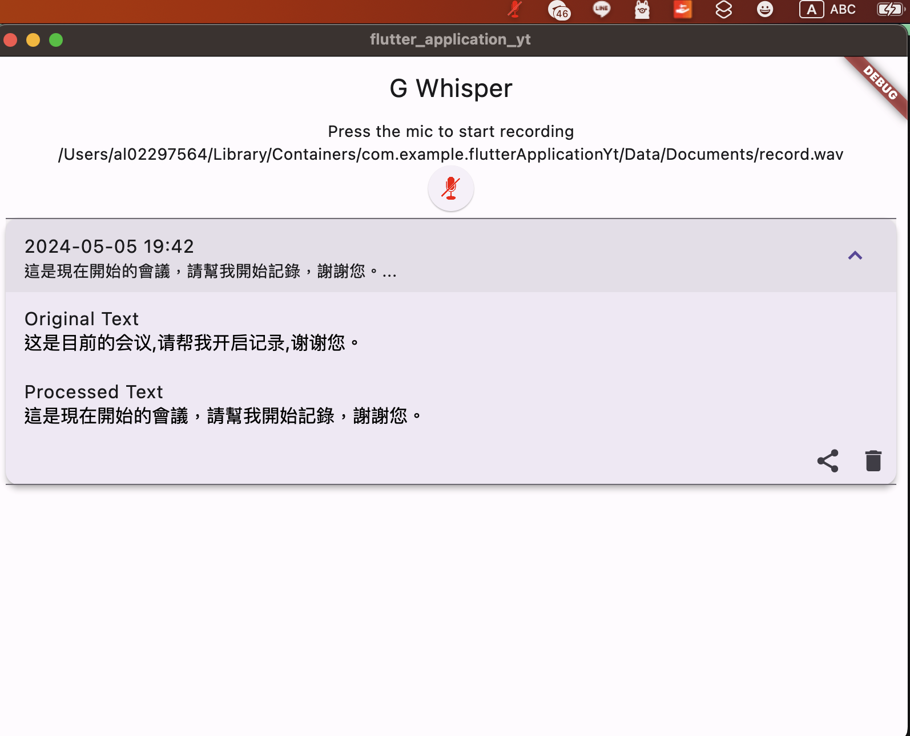

# G Whisper
## Screenshot


## Overview
"G Whisper" is a Flutter application designed for audio recording with dynamic icon updates based on recording status and voice detection. It offers background recording capabilities, system-wide hotkey support, and audio amplitude monitoring to differentiate between silence and sound during a recording session.

## Features
- Audio recording with a toggle start/stop functionality.
- System tray integration with context menu for quick settings access and app closure.
- Dynamic tray icon changes based on recording status and voice activity.
- Hotkey support for starting/stopping recordings.
- Settings dialog for configuring API keys and other preferences.
- Recording logs with options to edit, share, and delete recordings.

## System Requirements
- Flutter SDK
- Compatible with Android and iOS. (Note: Tray functionality is desktop-specific; modifications may be required for full mobile compatibility.)

## Installation

1. **Clone the repository:**
   ```bash
   git clone https://github.com/cctuan/g-whisper.git
   cd g-whisper
   ```

2. **Install dependencies:**
   ```bash
   flutter pub get
   ```

3. **Run the application:**
   ```bash
   flutter run
   ```

## Usage
- **Start the Application:** Open the application via your desktop or command line with `flutter run`.
- **Record Audio:** Click the microphone icon in the app or press the hotkey (Alt + W by default) to start and stop the recording.
- **Access Settings:** Right-click the tray icon and select 'Settings' to configure API keys and prompts.
- **View Recordings:** Access the recordings log through the main interface to edit, share, or delete entries.

## Configuration
- **Hotkeys:** Modify the `_setupHotKey()` method within `main.dart` to change the default hotkey settings.
- **API Keys:** Use the settings dialog accessible from the system tray to update API keys and other configurations.

## Contributing
Contributions to "G Whisper" are welcome. Please fork the repository, make your changes, and submit a pull request.

## License
Specify the license under which your project is made available. Common licenses for open-source projects include MIT, GPL, and Apache.

## Contact
For support, feature requests, or contributions, please contact [georgeiscoming@gmail.com](mailto:georgeiscoming@gmail.com).
